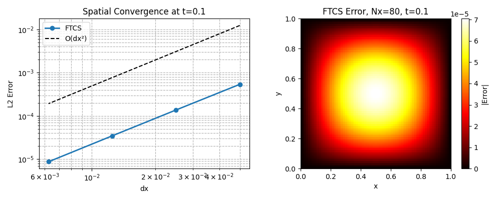
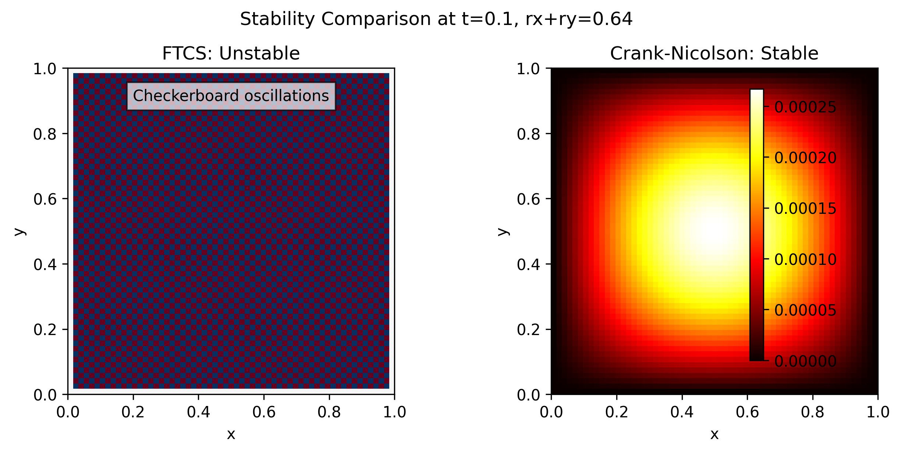

# 2D Heat Equation Solver in Python

Compares explicit, implicit, and Crank-Nicolson schemes for solving ∂u/∂t = α(∂²u/∂x² + ∂²u/∂y²). Built to explore stability and efficiency of numerical methods for Optimization/ML research.

## Results



## Method
- **Space discretization**: Central difference, O(Δx²) accuracy  
- **Time stepping**: Crank-Nicolson, unconditionally stable  
- **Implementation**: Vectorized NumPy, ~10x faster than nested loops for Nx=Ny=200

## Features
- Crank-Nicolson implicit scheme for stability
- Dirichlet and Neumann boundary conditions  
- NumPy vectorized implementation
- Animated visualization of temperature evolution

## Files
- `heat_solver.py` – Main solver using Finite Difference Method
- `method_comparison.py` – Compares explicit vs implicit vs Crank-Nicolson schemes

## Run it
```bash
pip install -r requirements.txt
python heat_solver.py  # edit ALPHA, NX, NT inside the file to change diffusion rate / grid size
```

## Method
Uses central difference in space, Crank-Nicolson in time. Stable for all time steps.

## Author
Malika Hurain – MSc student applying to UoA PhD in Optimization/ML
